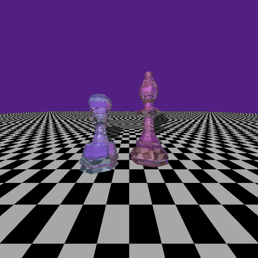

# CMPT361 Bonus of Assignment 3

## Assignment Requirements
All requirements in part(A) are completed

## Instructions
1. Enter the directory
2. Run `make` to build the `raycast`
3. Run `raycast` command as following:

`./raycast -u step_max [+s] [+l] [+r] [+c] [+f] [+p]`

The test commands are similar to that in [Assignment3](../Assignment3) other than that the default scene is unavailable.

|Flag|Meanning|
|---|---|
|`-u`|User scene.|
|step_max| An integer denoting the maximum steps of raytracing|
|`+s`| Include Shadown|
|`+l`| Include reflection|
|`+r`| Include refraction|
|`+c`| Include the chess board pattern|
|`+f`| Enable diffuse rendering with stochastic ray generations|
|`+p`| Enable super sampling|

Full test command:

`./raychess –u step_max +s +l +r +f +c +p`

## Rendering Effect
