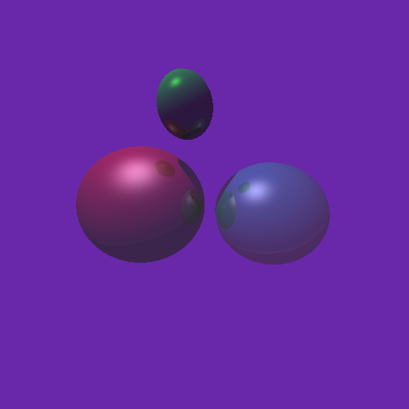
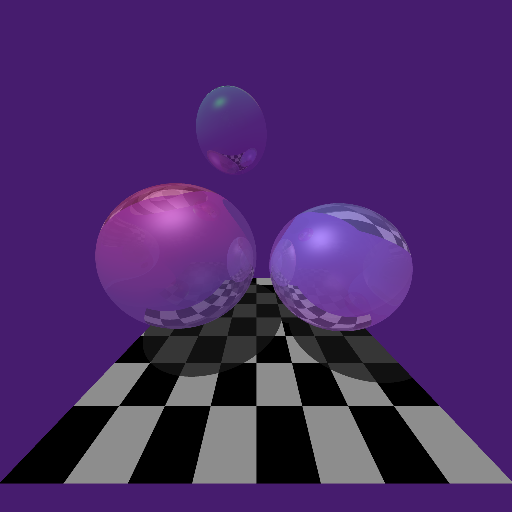

#CMPT361 Assignment3 Raytracer

## Assignment Requirement
### Basic Part
All features are completed as required.

### Extended Part
Refraction is only available for user scene `-u`.

## Instructions
1. Enter the directory
2. Run `make` to build the `raycast`
3. Run `raycast` command as following:

`./raycast [-u|-d] step_max [+s] [+l] [+r] [+c] [+f] [+p]`

|Flag|Meanning|
|---|---|
|`-u`|User scene.|
|`-d`|Default scene.|
|step_max| An integer denoting the maximum steps of raytracing|
|+s| Include Shadown|
|+l| Include reflection|
|+r| Include refraction|
|+c| Include the chess board pattern|
|+f| Enable diffuse rendering with stochastic ray generations|
|+p| Enable super sampling|

### Example commands:
`./raycast [–u | –d] 0`

`./raycast [–u | –d] 0 +s`

`./raycast [–u | –d] step_max +s +l +c`

`./raycast –u step_max +s +l +r +c`

`./raycast –u step_max +s +l +r +c +f`

`./raycast –u step_max +s +l +r +f +c +p`

### Example Outcome:
#### Default scene

#### User scene
